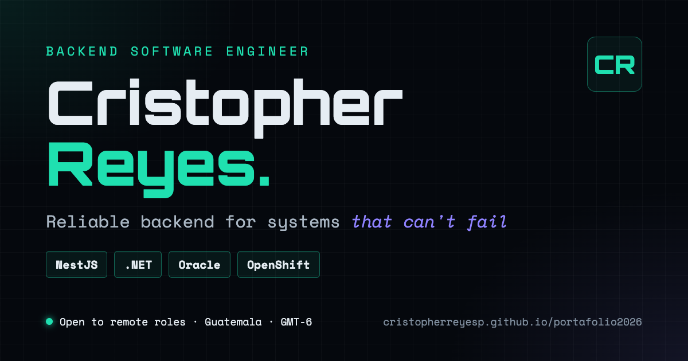

# portafolio2026

Personal portfolio of Cristopher Reyes, Backend Software Engineer (NestJS, .NET, Oracle, OpenShift). A static site with no framework and no runtime dependencies.

**Live site:** https://cristopherreyesp-portafolio.onrender.com (also served at https://cristopherreyesp.github.io/portafolio2026/)



## Overview

The site presents my backend work for recruiters and engineering teams:

- Case studies from production work in the financial sector, with conceptual diagrams and no internal details.
- Stack grouped by the part of the system it solves: services, data, platform and integration.
- Technical notes and articles (in Spanish), with search and an RSS feed.
- Downloadable CV in English and Spanish.
- An interactive terminal and a small mascot that answer questions about my experience. The mascot uses a local keyword matcher over canned answers: no model and no network calls.
- English / Spanish toggle.

## Project structure

- `index.html` — single-page layout and SEO metadata
- `css/components/` — one stylesheet per section, bundled into `css/bundle.css`
- `css/build.sh` — regenerates `css/bundle.css`; run it after editing any CSS file
- `js/components/` — interactive pieces (terminal, keyboard, pomodoro, animations)
- `js/i18n/` — Spanish / English translations
- `js/learning/focuses.js` — the (max 3) learning focuses shown on the home page; evidence links itself via `learning: [id]`
- `content/` — Markdown notes, articles and drafts (see `content/README.md`)
- `scripts/build-content.mjs` — builds note pages, the blog search index, `sitemap.xml` and `blog/rss.xml`
- `resume/` — downloadable CVs (ES/EN); `resume/build.sh` regenerates them from `resume/src/`
- `og-image.png` — social preview (1200×630); its source and render command are in `scripts/templates/og-image.html`

## Tech stack

- HTML, CSS and vanilla JavaScript — no framework, no bundler, no npm dependencies
- Node.js scripts for the content build and the tests (`node:test`)
- Shell scripts for the CSS bundle and the CV build

## Key technical decisions

- **No framework.** The site is small and mostly static, so plain HTML, CSS and JavaScript keep it fast and easy to host anywhere.
- **One stylesheet per section, one bundle in production.** Sections stay easy to edit, and the page loads a single CSS file.
- **Content as Markdown.** Notes and articles are written in Markdown and turned into static pages, a search index, the sitemap and the RSS feed by one build script, so there is no server or CMS.

## Running locally

```bash
python3 -m http.server 8000
# open http://localhost:8000
```

After editing CSS or content:

```bash
./css/build.sh                      # regenerate css/bundle.css
node scripts/build-content.mjs      # regenerate notes, search index, sitemap and RSS
```

## Testing

```bash
node --test tests/pet-brain.test.mjs tests/content.test.mjs
```

## Contact

- LinkedIn: https://www.linkedin.com/in/cristopherrp
- Email: reyescristop@gmail.com
